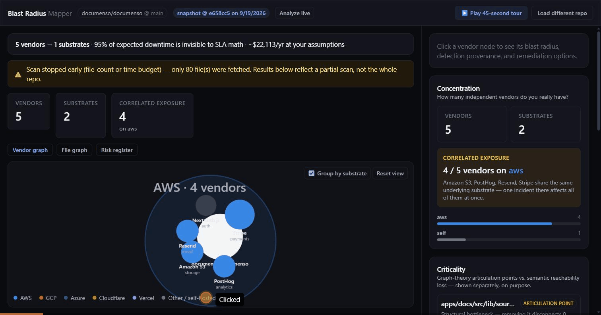
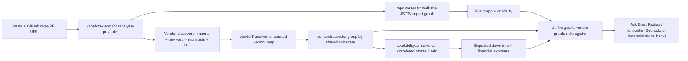
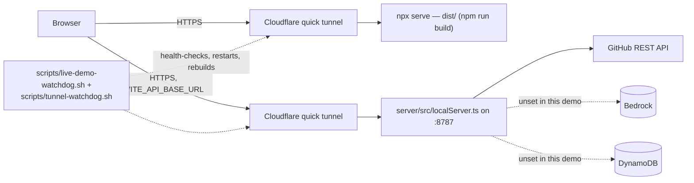
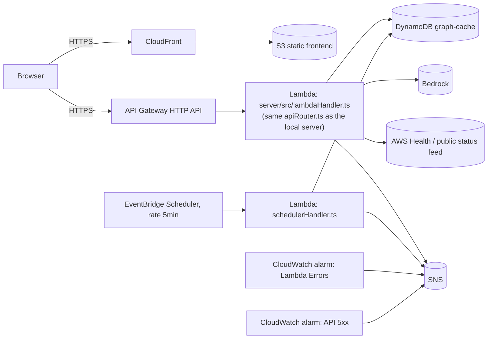
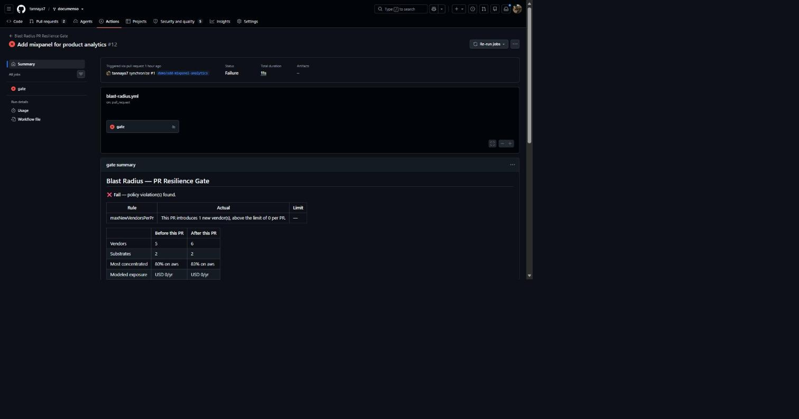
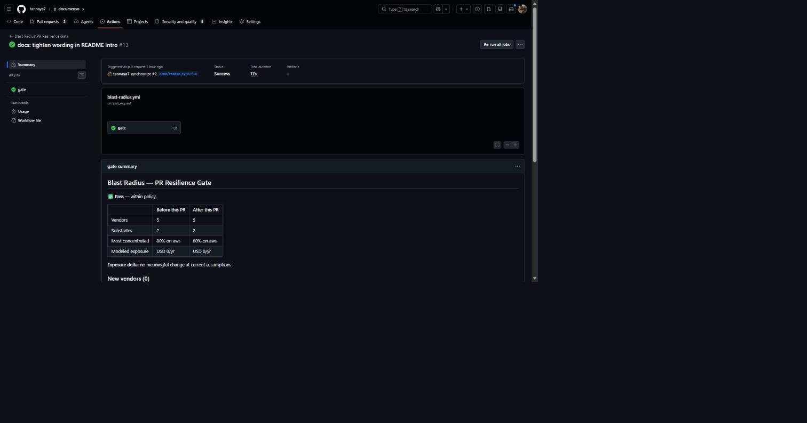

# Blast Radius Mapper

[](https://github.com/tannaya7/Domino/actions/workflows/ci.yml)

See what breaks before it breaks: paste a GitHub repo, and in seconds see which third-party
vendors secretly share infrastructure, and what a shared outage would actually cost you.

**🔴 Live demo: [waters-hawaiian-computational-displays.trycloudflare.com](https://waters-hawaiian-computational-displays.trycloudflare.com)** — or skip straight to the guided tour: **[…/?tour=1](https://waters-hawaiian-computational-displays.trycloudflare.com/?tour=1)** (45 seconds, no input required).

> The live URL is a real backend behind a Cloudflare tunnel, kept up by a self-healing watchdog
> (`scripts/live-demo-watchdog.sh`) — not a permanent AWS deployment. If it's ever down when you
> read this, `npm run dev` + `npm run server:dev` reproduces it exactly in under a minute (see
> [Run locally](#run-locally-in-5-commands)), and the bundled example repos below work with **zero
> backend at all**. See [Honest by design](#honest-by-design) for why this distinction matters.



## Try it in 30 seconds

1. Open the [live demo](https://waters-hawaiian-computational-displays.trycloudflare.com).
2. Click **`documenso/documenso`** under "Try an example" — loads instantly, no GitHub call needed.
3. Click the highlighted vendor cluster (or any node) to see its blast radius, then **Simulate** an outage.

Or paste your own `https://github.com/owner/repo` into the input instead of step 2 — that's a real, live scan.

## Why it matters

<!-- readme-numbers:start -->
<!-- Generated by `tsx scripts/readme-numbers.ts` from public/demo/documenso__documenso.json (commit e658cc5) and docs/VERIFICATION.md — do not hand-edit between these markers, re-run the script instead. -->
- **5 third-party vendors, but only 2 independent substrates** — 80% of vendors in [`documenso/documenso`](https://github.com/documenso/documenso) (`Amazon S3, PostHog, Resend, Stripe`) share one substrate (`aws`) — an outage there takes all of them down together, something no per-vendor dependency list shows.
- **80 files scanned, 207/216 internal imports resolved (95.8%)** — the import-graph resolver's own real coverage on this repo, not a claimed number.
- **One ranked mitigation, quantified**: "Add Razorpay as a failover for Stripe" is modeled to cut expected annual exposure by $525/yr against a $22,113/yr baseline (2.4%) — under explicit, editable assumptions, never presented as a guarantee.
- **684 tests across 68 files — ✅ 684/684 passed**, real Monte Carlo/differential/fuzz coverage — see [docs/VERIFICATION.md](docs/VERIFICATION.md).
<!-- readme-numbers:end -->

A dependency list tells you *what* you depend on. It doesn't tell you that four of your "independent"
vendors all run on the same substrate, so one AWS regional outage takes out four services your
uptime dashboard tracks separately.

## How it works



Every arrow above is real code, not a planned feature — `src/lib/` is the shared, pure-logic core
(also imported by the backend, so the UI and the API never disagree about what a "vendor" or
"substrate" means); `server/src/apiRouter.ts` is the one route table both the local Node server
and the Lambda handler share.

## Deployed architecture

**What's actually running behind the live URL above right now** — a single local process pair,
each exposed through its own Cloudflare quick tunnel:



**What the code is written and tested for, not yet deployed** — see [DEPLOYMENT.md](DEPLOYMENT.md)
and [`template.yaml`](template.yaml) (AWS SAM, `sam deploy` via [`scripts/deploy.sh`](scripts/deploy.sh)):



Why the gap: no AWS account was available while building this (see
[docs/AWS_VERIFICATION.md](docs/AWS_VERIFICATION.md) for exactly what *has* been verified live —
GitHub integration, yes; every AWS integration below, running its documented fallback, not yet the
real thing). The target architecture isn't aspirational hand-waving — it's a complete, reviewed SAM
template with least-privilege IAM, arm64 Lambdas, on-demand DynamoDB with TTL, API throttling, and
CloudWatch alarms already wired to SNS (see [docs/WELL_ARCHITECTED.md](docs/WELL_ARCHITECTED.md))
— it just hasn't had a real `sam deploy` run against it yet.

## AWS services and why

| Service | Why | Verified |
|---|---|---|
| **Lambda + API Gateway (HTTP API)** | Runs `apiRouter.ts` — the same route logic as local dev, one `$default` proxy route so new endpoints never touch the template. | ❌ [Not deployed](docs/AWS_VERIFICATION.md) — covered by `server/test/lambdaHandler.test.ts` (mocked event shapes) |
| **DynamoDB** (`graph-cache`, on-demand, TTL) | Caches repo scans across invocations — a cold Lambda shouldn't re-walk a 200-file import graph on every request. | ❌ [Not configured](docs/AWS_VERIFICATION.md) — in-memory fallback verified instead |
| **Bedrock** | Generates risk narratives and remediation runbooks; every output is labeled `generatedBy: "bedrock"` or `"deterministic"` — never silently swapped. | ❌ [No model access available](docs/AWS_VERIFICATION.md) — deterministic fallback verified live |
| **AWS Health** (+ public status feed fallback) | Live incident data for AWS-hosted vendors; falls back to AWS's public RSS feed (most accounts lack the Business/Enterprise support plan Health's API requires), then to `"unknown"` — never a fabricated "healthy". | ❌ [Not enabled](docs/AWS_VERIFICATION.md) — public-feed fallback verified live |
| **SNS** | Vendor-degradation alerts, and (new) CloudWatch alarms on Lambda `Errors` and API `5xx`. | ❌ [Not configured](docs/AWS_VERIFICATION.md) — no-op fallback verified |
| **CloudWatch Alarms + Log Groups** | Two alarms (`ApiFunctionErrorsAlarm`, `HttpApi5xxAlarm`) publish to the same SNS topic; 14-day log retention on both Lambdas. | ❌ Not deployed — defined in `template.yaml`, never evaluated against real traffic |
| **EventBridge Scheduler** | Polls vendor status every 5 minutes via a separate Lambda, decoupled from API traffic. | ❌ Not deployed — `server/src/scheduler.ts` is the in-process local-dev stand-in, verified live |
| **S3 + CloudFront** | Static frontend hosting with Origin Access Control (no public bucket) and SPA fallback routing. | ❌ Not deployed — the live demo above uses `npx serve` behind a Cloudflare tunnel instead |
| **SSM Parameter Store** | Holds the GitHub PAT as a SecureString rather than a plaintext Lambda env var. | ❌ Not deployed |
| **GitHub REST API** (not AWS, but load-bearing) | Repo/PR content, changed files, diffs. | ✅ [Verified live](docs/AWS_VERIFICATION.md) this session against 3 real repos |

## Honest by design

- **Unknown is never healthy.** A status check that fails, times out, or has no data reports
  `"unknown"` — never a fabricated `"operational"` (`server/src/statusPoll.ts`, `awsHealth.ts`).
- **AI output is always labeled.** Every Bedrock-or-fallback response carries `generatedBy:
  "bedrock" | "deterministic"` in its own payload, not just in prose — the UI and the gate's PR
  comment both show which one actually ran.
- **Every assumption is editable, in view, and never hidden inside a number.** Downtime cost,
  per-vendor SLA, per-substrate outage probability — all explicit inputs in the Assumptions panel,
  not baked-in constants. Every exposure figure says "modeled estimate under editable assumptions,"
  not "the cost."
- **What we do NOT claim:** that this finds every vendor (only what the curated map + detectors
  recognize); that "substrate" means a specific data center or AZ (it's provider-level — see
  Limitations); that financial exposure is a prediction rather than a Monte Carlo estimate under
  assumptions you set; that anything below is a verified AWS deployment rather than a fallback path
  verified in its place (see [docs/AWS_VERIFICATION.md](docs/AWS_VERIFICATION.md)); that AI-authored
  test/verification content in [docs/HOW_THIS_WAS_BUILT.md](docs/HOW_THIS_WAS_BUILT.md) replaces
  human review — it's disclosed, not hidden.

## PR Resilience Gate (GitHub Action)

A composite GitHub Action (bash + curl + jq + gh only — no Node runtime, no build step) that comments on every PR with the new shared-fate vendor risk it introduces, and can fail the check against a policy file you own. Proof of it running on real PRs (one that fails, one that passes) is in [docs/proof/PROOF.md](docs/proof/PROOF.md).

| A PR that fails the gate | A PR that passes it |
|---|---|
|  |  |

### Add it in 30 seconds

1. Copy [`examples/workflow.yml`](examples/workflow.yml) to `.github/workflows/blast-radius.yml` and set `api-url` to a running Blast Radius Mapper API (the live demo's backend above works for a quick trial).
2. (Optional) Copy [`examples/.blast-radius.json`](examples/.blast-radius.json) to `.blast-radius.json` at your repo root to turn on policy enforcement — without it, the gate is report-only and never fails the check.
3. Push. Every PR gets a sticky comment (updated in place on new pushes, not reposted) with new vendors, before/after concentration, modeled exposure delta, and a "why it matters" note.

If you forked the showcase repo to try this yourself: **Actions are disabled by default on forks** — go to the Actions tab of your fork and enable them, or the workflow will silently never trigger.

### Policy schema (`.blast-radius.json`)

| Key | Type | Meaning |
|---|---|---|
| `maxSubstrateShare` | 0-1 | Fail if more than this share of vendors would share one substrate after the PR. |
| `minSubstrates` | integer | Fail if fewer than this many distinct substrates remain after the PR. |
| `maxNewVendorsPerPr` | integer | Fail if the PR introduces more new vendors than this. |
| `maxEntrypointsAffectedPct` | 0-100 | Fail if more than this percent of the repo's entrypoints are affected. |
| `maxExposureIncreasePerYear` | number | Fail if modeled annual exposure increases by more than this (a decrease never fails). |
| `failOn` | `"fail"` \| `"warn"` | Whether a violation blocks the check (`fail`, exit 1) or just comments (`warn`, default). |

No policy file → every PR is report-only (`status: "info"`), and the check never fails — you get the visibility first, and can turn on enforcement whenever you're ready. An unknown key in the policy file is rejected with a clear error rather than silently doing nothing.

### Real-world behavior

- **Fails open.** If the API is down, times out (28s), or errors, the check warns and passes — a backend outage never blocks every PR in the repo (`fail-on-error: true` overrides this if you want the opposite).
- **Fork PRs get a read-only token** by GitHub's own design — the gate detects this, skips the comment, and still writes the same report to the job's step summary, without failing.
- **Never re-posts.** The comment carries a hidden marker and is updated in place on every push to the PR, not duplicated.

## Run locally in 5 commands

```bash
git clone https://github.com/tannaya7/Domino.git && cd Domino
npm install
npm run server:dev   # backend  — http://localhost:8787 (leave running)
npm run dev           # frontend — http://localhost:5173 (separate terminal)
npm run verify         # optional: typecheck + full test suite + production build
```

No AWS account, no API keys, and no `.env` file are required for any of the above — every example
repo and the sample-data tab work with zero configuration. Set `GITHUB_TOKEN` in `server/.env`
(copy `server/.env.example`) only if you plan to analyze many real repos and hit GitHub's
unauthenticated 60 req/hour limit.

## Limitations and roadmap

- **JS/TS import graphs only.** The file-graph engine walks `.ts`/`.tsx`/`.js`/`.jsx` imports
  (`server/src/repoParser.ts`) — a Python/Go/Rust-only repo will scan 0 files, not partially work.
- **Curated vendor map, not universal detection.** ~33 vendors across `server/src/vendorMap.ts` are
  recognized by import name, env var pattern, manifest entry, or IaC reference — an unlisted vendor
  isn't detected, and detection quality depends on how idiomatically it's imported.
- **Substrates are provider-level, not physical infrastructure.** "Shares `aws`" means "hosted on
  AWS," not "in the same AZ, account, or even region" — a real correlated-failure analysis would
  need infrastructure data this tool doesn't have access to (repo source only, no cloud account
  introspection).
- **Public GitHub repos only, today.** `/analyze-repo` and `/analyze-pr` call the public GitHub
  REST API — no way to reach a private repo without exposing a token to this backend.
- **Roadmap: a local CLI for private repos.** Same `repoParser.ts`/`vendorResolver.ts` engine,
  run against a local checkout instead of GitHub's API — no token ever leaves your machine. Not
  built yet.

## Tests

CI (badge at the top of this file) runs `npm run verify:all` (typecheck + lint + full test suite,
writing [docs/VERIFICATION.md](docs/VERIFICATION.md) from the real results) plus `npm run build` on
every push/PR to `main` — confirmed green on [PR #3](https://github.com/tannaya7/Domino/pull/3)
before this badge was added.

684 tests across 68 files, real numbers regenerated on every `npm run verify:all` run — differential
tests against brute-force reference implementations, iterative-traversal robustness at 100,000+
nodes, scanner fuzzing, and a short security review. Full breakdown, with exact reproduction
commands for every claim: [docs/VERIFICATION.md](docs/VERIFICATION.md). AWS/Bedrock-specific live
integration status (a distinct claim from "the fallback is tested") is in
[docs/AWS_VERIFICATION.md](docs/AWS_VERIFICATION.md). How this was built with AI assistance, and
what was checked by hand, is in [docs/HOW_THIS_WAS_BUILT.md](docs/HOW_THIS_WAS_BUILT.md).

## Project layout

- `src/lib/` — shared, pure-logic core (also used by the backend): the file-graph engine (`graph.ts`), plus `concentration.ts`, `criticality.ts`, `availability.ts`, and the shared type contracts in `types.ts`.
- `server/` — local Node/TypeScript backend (also deployable to Lambda, see [DEPLOYMENT.md](DEPLOYMENT.md)): `repoParser.ts` walks a repo's import graph and runs vendor discovery; `vendorMap.ts`/`vendorResolver.ts`/`envScanner.ts`/`manifestParser.ts`/`iacParser.ts` are the detection pipeline; `cache.ts`, `bedrock.ts`, `awsHealth.ts`, `sns.ts` are the real AWS integrations; `apiRouter.ts` is the transport-agnostic route logic shared by `requestHandler.ts` (local Node http server) and `lambdaHandler.ts` (API Gateway).
- `action/` — the PR Resilience Gate's composite GitHub Action.
- `docs/` — everything referenced above: verification evidence, architecture, submission answers, and exactly what screenshots/media to capture ([docs/media/README.md](docs/media/README.md)).

## License

[MIT](LICENSE)
