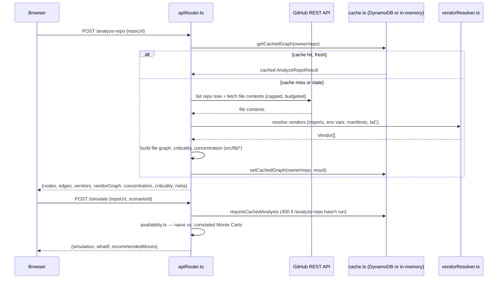
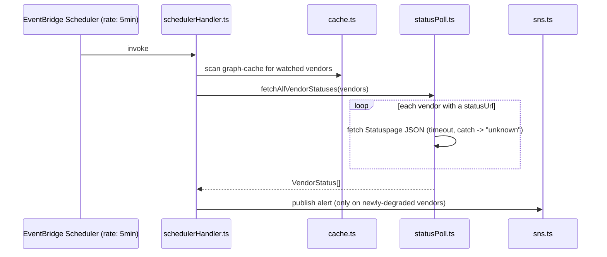
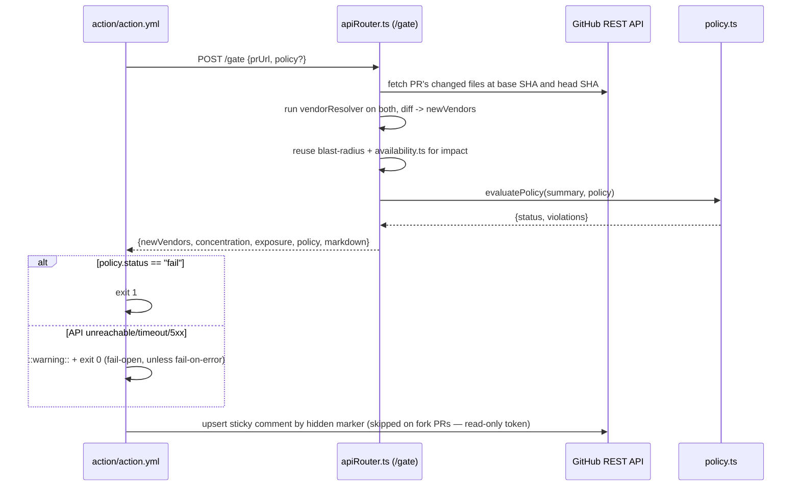

# Architecture

Two things live in this repo: the app itself (request flow below), and the PR Resilience Gate, a
separate GitHub Action that calls the same backend's `/gate` route. Both share the same failure
philosophy — see the fallback table at the bottom.

## Request flow

`/analyze-pr`, `/status`, `/runbook`, `/ask`, and `/gate` follow the same shape — one `apiRouter.ts`
function per route, all sharing `requireCachedAnalysis` where they operate on an already-scanned
repo. `/gate` is the one exception that does its own independent before/after scan (see
[docs/proof/PROOF.md](proof/PROOF.md) for what it actually returns on real PRs) rather than reusing
a single cached analysis, since it needs both the base and head SHA's vendor sets.

## Scheduler flow (vendor status polling)

Locally, `server/src/scheduler.ts` is the in-process stand-in for this — same
`fetchAllVendorStatuses`/`sns.ts` logic, driven by a `setInterval` instead of EventBridge.

## Request flow: PR Resilience Gate

## Failure modes and fallbacks

| Component | Failure | Behavior | Where in code |
|---|---|---|---|
| GitHub API | Rate-limited, private repo, deleted repo, network error | Human-readable error surfaced to the UI; RepoInput offers "use sample data" or a bundled example as a working alternative | `server/src/github.ts` (`GithubApiError`), `src/components/RepoInput.tsx` |
| DynamoDB graph cache | `DYNAMODB_GRAPH_CACHE_TABLE` unset, or a call fails/times out | Falls back to an in-memory `Map` (same process only — lost on cold start) | `server/src/cache.ts` |
| Bedrock (risk summaries, runbooks) | `BEDROCK_MODEL_ID` unset, or the call fails | Deterministic generator produces the same output shape; response is labeled `generatedBy: "deterministic"` | `server/src/bedrock.ts`, `runbook.ts`, `riskSummary.ts` |
| AWS Health | `AWS_HEALTH_ENABLED` unset (default), or `SubscriptionRequiredException` (no Business/Enterprise support plan) | Falls back to AWS's public status RSS feed; if that also fails, reports `"unknown"` — never `"healthy"` | `server/src/awsHealth.ts` |
| Vendor status (Statuspage) | No `statusUrl`, network error, timeout, bad JSON | Reports `indicator: "unknown", stale: true` — the UI never shows a fabricated "operational" | `server/src/statusPoll.ts` |
| SNS alerts | `SNS_ALERT_TOPIC_ARN` unset | No-op — nothing errors, nothing is sent | `server/src/sns.ts` |
| PR Resilience Gate API call | Down, times out (28s), non-2xx | `::warning::` + exit 0 (never blocks the PR on a backend outage), unless `fail-on-error: true` | `action/action.yml` |
| PR Resilience Gate comment post | PR is from a fork (read-only `GITHUB_TOKEN`) | Comment is skipped; the same markdown still goes to `$GITHUB_STEP_SUMMARY`; the check itself still evaluates and can still fail | `action/action.yml` |
| Whole backend unreachable from the browser | Any `fetch` failure to the API base URL | A dismissible "API unreachable: example snapshots still work" banner appears (polls `GET /health` every 30s); every bundled example repo and the JSON-paste tab work fully offline from the backend | `src/lib/useApiHealth.ts`, `src/components/ApiHealthBanner.tsx` |
| Malformed/oversized request body | Body over `MAX_BODY_BYTES`, or unparseable JSON | `413`/`400` with a specific message — never a crash | `server/src/limits.ts`, `requestHandler.ts`, `lambdaHandler.ts` |

`GET /health` (added for this submission — see `server/src/apiRouter.ts`'s `healthCheck()`) reports
which of the above integrations are configured in the running process, so "backend is up" and
"backend is up but running every fallback" are distinguishable without guessing from behavior.
